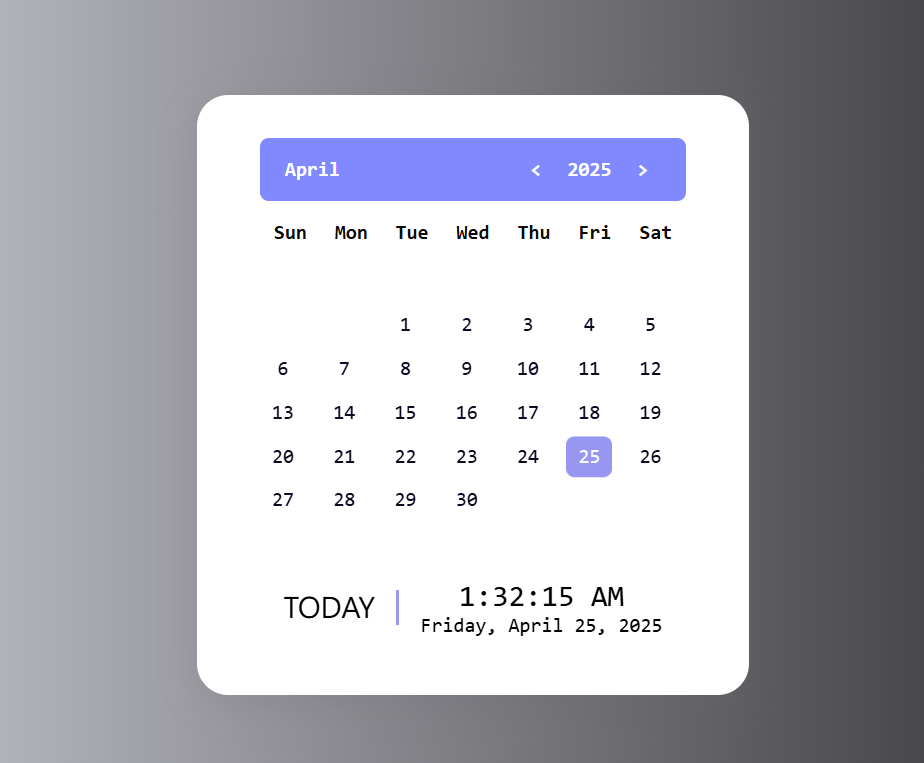

# 📅 Calendar App

A simple and responsive calendar built using **HTML**, **CSS**, and **JavaScript**. This project displays the current month,year and time, highlights the current date, and allows users to navigate through months.

## 🔧 Features

- Displays current month,year and time.
- Highlights today's date
- Navigation for previous and next months
- Responsive design for different screen sizes
- Fully client-side, no backend required

## 🛠️ Built With

- HTML  
- CSS3  
- JavaScript

## 📸 Screenshot



## 🚀 Getting Started

1. Clone the repository:
   ```bash
   git clone https://github.com/rohitchauhan07-hub/Calendar
